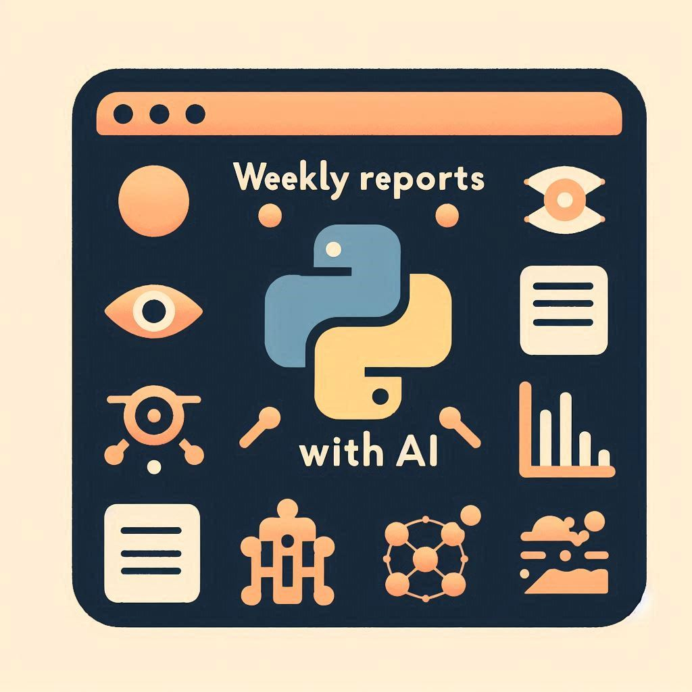

	<h1>Report Creator AI</h1>
	
	

	

## 🚀 Introduction

This project consists of a weekly report creator using artificial intelligence and stored on Google Drive

## 👨‍💻 Technologies

- [Python](https://www.python.org/): Main programming language.
- [CrewAI](https://docs.crewai.com/): Cutting-edge framework for orchestrating role-playing, autonomous AI agents.
- [Poetry](https://python-poetry.org/): A tool for managing dependencies in Python projects.
- [Pydantic](https://docs.pydantic.dev/latest/): Pydantic is the most widely used data validation library for Python.
- [LMStudio](https://lmstudio.ai/): LM Studio is a desktop application for running local LLMs on your computer.
- [DiscordAPI](https://discord.com/developers/docs/intro): A toolkit of APIs and resources pair splendidly with a supportive community to help you build bots, integrate 3rd party services, and add Discord support to your game.
- [GoogleDrive](hhttps://orm.drizzle.team/): Google's cloud file storage service gives users personal storage space.

## 🏗️ Design Patterns

The application follows the following design patterns:

1. **Clean Architecture**: The project structure is organized in layers (use cases, interfaces) to separate concerns and facilitate maintenance.

2. **SOLID**: The acronym SOLID represents the five principles that facilitate the development process.

3. **Repository**: The Repository Pattern allows encapsulation of data access logic.

4. **Dependency Injection**: Inversion of control and dependency injection are used to ensure code flexibility and testability.

## 🎯 Main Features

- [x] Generate reports using artificial intelligence
- [x] Send the generated report to Google Drive.
- [x] Consume the content that will be used to generate the report from a discord channel

## 🔧 Running the project

To run this application, you need to have [Python](https://www.python.org/) installed on your machine and poetry as package manager

- Run the command `touch .env && cp .env.example .env` to create environment variable files.
- I'm running the LLMs using [LMStudio](https://lmstudio.ai/) if you want change to use in the cloud you be free to make this.
- Run the command `poetry install` to download the dependencies.
- Run the command `poetry run task dev` to start the application.

## ✍🏽 Important learnings

- Working with the Python language and seeing that it is very simple to implement things since this is not my main language but in a short time of using it I can do a lot of things
- How to use crew ai to realize artificial intelligence agents to automate tasks
- Use Google Drive APIs to upload content
- Integrate AIs that are running locally on the machine into the code

## 🧑‍💻 Possible improvements

- Further decouple code to better facilitate test implementation
- Add unit and end to end tests to ensure correct code operation
- Allow the user to easily change the data source for generating reports
- Create a graphical interface to facilitate interaction

## 📄 License

This project is under the MIT license. Access the link [LICENSE](https://mit-license.org/) for more details.

## 🌐 GitHub

The source code of the application can be found on GitHub: [Project Link](https://github.com/nitoba/report-creator-ai)

## 📧 Contact

In case of doubts or suggestions, contact us through the email: [nito.ba.dev@gmail.com](mailto:nito.ba.dev@gmail.com).
